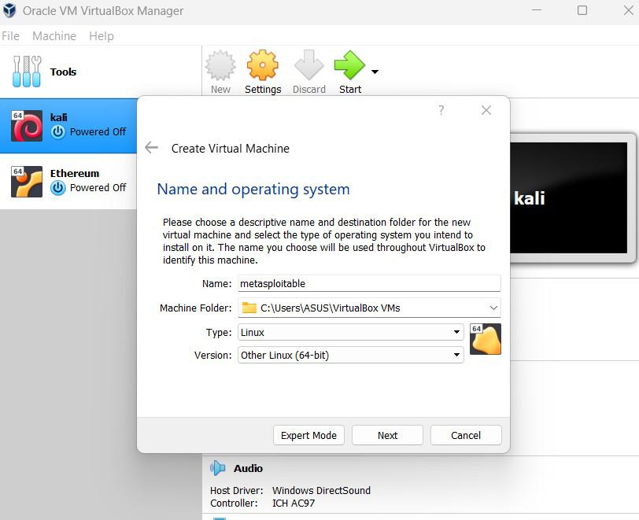

# How-to-install-Metasploitable
# Virtual-Metasploitable-Installation
Metasploitable home lab step by step installation guide Metasploitable is an intentional vulnerable virtual machine (VM) designed for the purpose of testing security tools, learning ethical hacking, and practicing penetration testing. Developed by Rapid7, it simulates real-world security vulnerabilities in a controlled environment. Metasploitable Normally Install in Linux With some Outdated software and Misconfigured Services and Exploitable Vulnerabilities It is often used with the Metasploit framework to search for and take advantage of security vulnerabilities. Users can switch between multiple attack types like unauthorised access, exploiting remote services, or testing web vulnerabilities. However, it’s strictly for educational purposes and should only be used in isolated environments to avoid exposing networks to potential risks.

<h2>Installation Process</h2>
<h3>Step 1.</h3>
Download Metasploitable from trusted sources like Rapid7's website. Choose the appropriate version, ensure a stable internet connection, and verify the download to avoid corrupted files for secure usage.

<h3>Step 2</h3>
.
After downloading Metasploitable, extract the compressed file using tools like WinRAR or 7-Zip. Save the extracted folder to a preferred location. This folder contains the virtual machine files needed for setup. Ensure the extraction completes successfully, as these files will be imported into a virtualization platform like VMware or VirtualBox.

<h3>Step 3</h3>
.
Click on the "New" option in VirtualBox to create a new virtual machine and begin the setup process.

A window will appear, prompting you to enter details for your virtual machine. Provide the following:

Name: Choose a name of your preference.

Path: Keep the default recommended path.

Version: Select "Other (64-bit)."

Fill in these details to proceed with setting up your virtual machine.

<h3>Step 4</h3>
.
Choose the amount of RAM to allocate to the virtual machine. It’s recommended to assign 512MB for optimal performance.

<h3>Step 5</h3>
.
Select the option to use an existing virtual hard disk file. This allows you to connect a pre-configured virtual drive.

<h3>Step 6</h3>
.
Set up the network settings for your virtual machine carefully to ensure security. It is highly recommended to use either NAT or Host-only network configurations. These options help keep the virtual machine isolated from public networks, preventing exposure to potential external threats. This is especially important for Metasploitable, as it is intentionally vulnerable and should never be connected to untrusted networks. Proper network configuration ensures a safe environment for testing and learning without risking unintended network access or compromising your system's security. Always double-check your settings to maintain isolation and secure your virtual lab.

Now locate the file that we have extracted.

Now save the file and you will see that the instance is created with the name you have given.

You’re all set! Simply click the "Start" button at the top to initiate the machine. Wait as it boots up and loads the instance, preparing your virtual environment for use.

<h3>Step 7</h3>
.
After the instance has finished loading, you’ll be prompted to enter a login name and password. The default credentials are as follows:

Login Name: msfadmin

Password: msfadmin

After logging in with the provided credentials, you’ll gain access to the machine, completing the installation process successfully.
